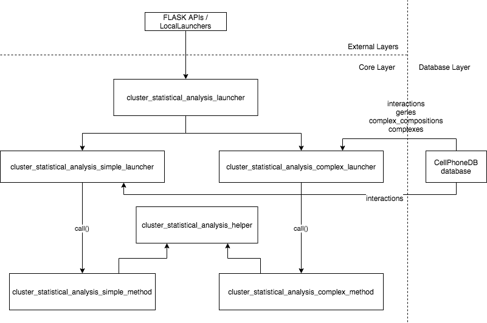
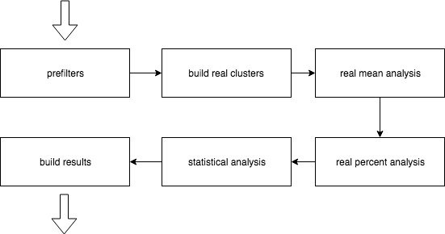
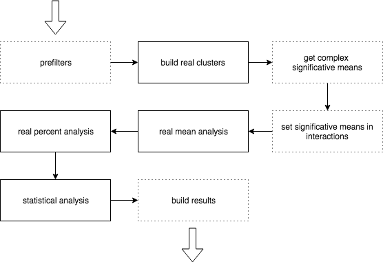
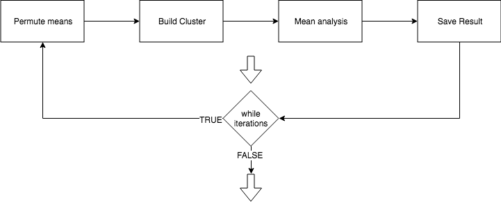

# Cluster Statistical Analysis method Workflow

This document is focused in Cluster Statistical Method, please, read before the [project_workflow documentation](project_workflow.md)
to have a more global vision of the project structure.

## Calling Cluster Statistical Method

This is the workflow when method call is launched:




**cluster_statistical_analysis_launcher**

This method allocated in `core/methods/method_launcher.py` is called from API's, local launchers or other future implementations.

Later, analysis is splited in two ways: one for simple analysis and other for comlpex analysis.

This is where CellPhoneDB database data is loaded. 

**cluster_statistical_analysis_{simple/complex}_method** 

This is where analysis method non common logic are implemented. This functions are completely isolated from the databases/frameworks. 

It just uses Pandas library to manage the datasets.

**cluster_statistical_analysis_helper**

This is where method common for simple/complex analysis is implemented.

## Cluster Statistical {simple/complex} Analysis workflow

Simple and complex analysis shares the analysis steps (present in _cluster_analysis_helper.py_) but complex requieres 
different data preprocess/postprocess.

**Simple analysis**




**Complex analysis**




### Prefilters

**Simple analysis**
This is where _counts_ input and interactions are filtrated. It removes:
- Duplicated ensembl: Keep the first.
- If count is not in CellPhoneDB interactions components.
- Empty counts: Remove counts if all row values are 0.
- Interactions without two components in counts.
- Orphan ensembls: if the ensembl is only on one interaction component


**Complex analysis**
- Finds the complex defined in counts and calculates their counts values
- Remove interactions if the simple component ensembl is not in the counts list
- Remove interactions if the complex component is not in the calculated complex list
- Remove undefined simple counts
- Merge simple filtered counts and calculated complex counts
- Remove duplicated counts


### Build real clusters

Builds the counts clusters original datasets (meta/counts).

Cluster process converts the counts dataset (ensembl/cells) to cluster dataset (ensembl/clusters) based on meta file relations. 
The value of cluster is the mean value of all components

_Example:_
```
INPUT
meta_input:
cell    cell_type
cell1   cluster1
cell2   cluster1
cell3   cluster2

counts_input:
            cell1   cell2   cell3
ensembl1    0.1     0.2     0.3
ensembl2    0.4     0.5     0.6
ensembl3    0.7     0.3     0.0

RESULT

dict{
    means: {
       'cluster1':
                   
           ensembl1   0.15      
           ensembl2   0.45      
           ensembl3   0.5
       
       'cluster2':
           ensembl1   0.3      
           ensembl2   0.6      
           ensembl3   0.0     
    },
    counts: {
        'cluster1':
                        cell1   cell2
            ensembl1    0.1     0.2  
            ensembl2    0.4     0.5  
            ensembl3    0.7     0.3  
        
        'cluster2':
                        cell3
            ensembl1    0.3
            ensembl2    0.6
            ensembl3    0.0
    }
}
```
### Real mean analysis

Calculates the mean for the list of interactions and for each cluster. If one of both is not 0 sets the value to 0.
```
EXAMPLE:
    cluster_means
               cluster1    cluster2    cluster3
    ensembl1     0.0         0.2         0.3
    ensembl2     0.4         0.5         0.6
    ensembl3     0.7         0.0         0.9

    interactions:

    ensembl1,ensembl2
    ensembl2,ensembl3

    RESULT:
                          cluster1_cluster1   cluster1_cluster2   ...   cluster3_cluster2   cluster3_cluster3
    ensembl1_ensembl2     mean(0.0,0.4)*      mean(0.0,0.5)*            mean(0.3,0.5)       mean(0.3,0.6)
    ensembl2_ensembl3     mean(0.4,0.7)       mean(0.4,0.0)*            mean(0.6,0.0)*      mean(0.6,0.9)


    results with * are 0 because one of both components is 0.
```
### Real percent analysis

It build a ensembl1_ensembl2/cluster1_cluster2 table of percent values.

**First**, calculates the percents for each ensembl/cluster:

The cluster percent is 0 if the number of positive cluster cells divided by total of cluster cells is greater than threshold
and 1 if not.

**Second**, calculates the percent value of the interaction:

_Example_:
```
INPUT:

threshold = 0.1
cluster1 = cell1,cell2
cluster2 = cell3

             cell1       cell2      cell3
ensembl1     0.0         0.6         0.3
ensembl2     0.1         0.05         0.06
ensembl3     0.0         0.0         0.9

interactions:

ensembl1,ensembl2
ensembl1,ensembl3


(after percents calculation)

             cluster1    cluster2
ensembl1     0           0
ensembl2     1           1
ensembl3     1           0

RESULT:
                    cluster1_cluster1   cluster1_cluster2   cluster2_cluster1   cluster2_cluster2
ensembl1_ensembl2   (0,1)-> 0           (0,1)-> 0           (0,1)->0            (0,1)->0
ensembl1_ensembl3   (0,1)-> 0           (0,0)-> 1           (0,1)->0            (0,0)->1
```


### Statistical analysis

It does mean analysis of shuffled meta multiple times (number of iterations). Saves all results in an array to process
in build results. 



### Build results

This is where results are created from the previous data analysis. The only non trivial processes are the 
pvalues and significant_means builds.


**Building Pvalues**

Sets the pvalue of ensembl1_ensembl2/cluster1_cluster2 values. 

The pvalue is 1 if real_mean or percent_real analyis are 0. If not, the vpalue is:

    (number of shuffled means > realmean) / total of shuffled times
    
 
**Building significant means**

Sets a result for ensembl1_ensembl2/cluster1_cluster2 of significant means.

The table entries are NaN if the corresponding pvalue is > than 0.05 or the corresponding real_mean value if not.

_Example_:
```
INPUT:

real mean
                     cluster1    cluster2    cluster
ensembl1_ensembl2    0.1         1.0         2.0
ensembl2_ensembl3    2.0         0.1         0.2
ensembl1_ensembl3    0.3         0.0         0.5

pvalues
                     cluster1    cluster2    cluster
ensembl1_ensembl2    0.0         1.0         1.0
ensembl2_ensembl3    0.04        0.03        0.62
ensembl1_ensembl3    0.3         0.55        0.02

min_significant_mean = 0.05

RESULT:

                     cluster1    cluster2    cluster
ensembl1_ensembl2    0.1         NaN         NaN
ensembl2_ensembl3    2.0         0.1         NaN
ensembl1_ensembl3    NaN         NaN         0.5
```


