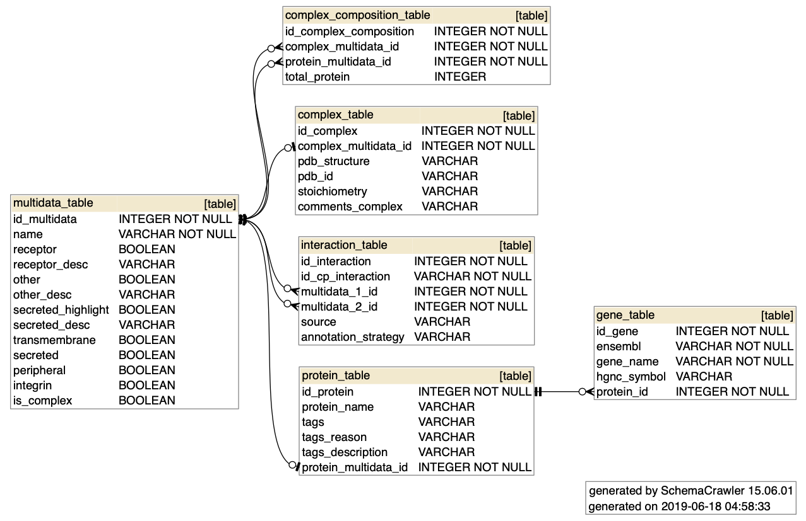

# CellPhoneDB Database 
CellPhoneDB uses [SqlAlchemy](https://www.sqlalchemy.org/) for database schema connection. By default runs using sqllite connector and its data are written to `cellphonedb/core/cellphone.db`.

## Cellphonedb Schema
This is the data schema:

**About Multidata table**

This saves the mutual info of proteins and complexes columns. That allows us to link interactions without needing to check if is simple or complex data.