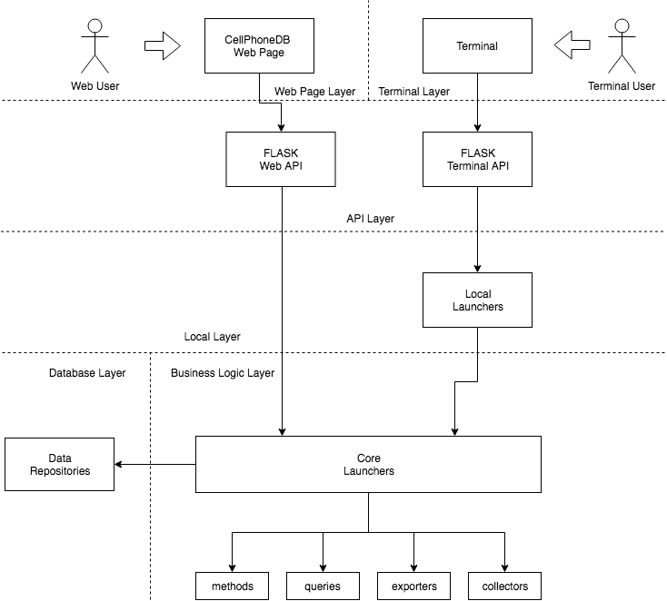

# CellPhoneDB project workflow
CellPhoneDB is developed using multiple libraries and frameworks.

The project is designed to isolate as much as possible the library dependence. This makes it easier to change the libraries
in a future.

This is the project modules/layers structure:

## Web Page Layer
Is a independent project developed in PHP. It enables a web portal to make requests an visualize results of CellPhoneDB.

The web system communicates to the server over the Flask Web http Api allocated in API Layer.

## Terminal Layer  
Is the user server communication portal. It enables some commands to make methods, queries, export data and update data.

It communicates with Flask Terminal API in API Layer

## API Layer
Is developed in [Flask](http://flask.pocoo.org/) and enables a http (using [Flask-RESTful extension](https://flask-restful.readthedocs.io/en/latest/))
 and terminal api (using  [Click Flask package](http://click.pocoo.org/5/)) to communicate with the outside.

## Local Layer
Is used to read/write input/output files in the system. Is it necessary to isolate Flask Terminal API and Core Layer 
during the loading/finishing processes.

## Business Logic Layer
This is where are allocated all CellPhoneDB Business Logic. It did not have dependence from flask/SqlAlchemy libraries and
it can be executed without load the previous layers. In the future, we will create a package to import CellPhonDB directly 
from other Python packages.

## Database Layer
This is where the database communications are done. Is developed using [SQLAlchemy](https://www.sqlalchemy.org/) and it 
isolates the ORM dependence. Outside of this layer, all data is processed using [Pandas library](https://pandas.pydata.org/) data structures.
